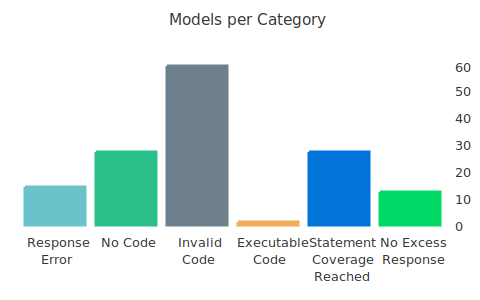

# Evaluation from 2024-04-25 19:31:35

This report was generated by [DevQualityEval benchmark](https://github.com/symflower/eval-dev-quality) in `version 0.4.0`.

## Results

> Keep in mind that LLMs are nondeterministic. The following results just reflect a current snapshot.

The results of all models have been divided into the following categories:
- Category Unknown: Models in this category could not be categorized.
- Response Error: Models in this category encountered an error.
- Response Empty: Models in this category produced an empty response.
- No Code: Models in this category produced no code.
- Invalid Code: Models in this category produced invalid code.
- Executable Code: Models in this category produced executable code.
- Statement Coverage Reached: Models in this category produced code that reached full statement coverage.
- No Excess Response: Models in this category did not respond with more content than requested.

The following sections list all models with their categories. The complete log of the evaluation with all outputs can be found [here](./evaluation.log). Detailed scoring can be found [here](./evaluation.csv).

### "Response Error"

Models in this category encountered an error.

- `openrouter/jebcarter/psyfighter-13b`
- `openrouter/anthropic/claude-2`
- `openrouter/openchat/openchat-7b:free`
- `openrouter/openrouter/cinematika-7b:free`
- `openrouter/jondurbin/bagel-34b`
- `openrouter/anthropic/claude-instant-1`
- `openrouter/haotian-liu/llava-13b`
- `openrouter/undi95/toppy-m-7b:free`
- `openrouter/anthropic/claude-2:beta`
- `openrouter/nousresearch/nous-hermes-2-vision-7b`
- `openrouter/anthropic/claude-instant-1:beta`
- `openrouter/nousresearch/nous-capybara-7b:free`
- `openrouter/perplexity/pplx-70b-online`
- `openrouter/lynn/soliloquy-l3`

### "No Code"

Models in this category produced no code.

- `openrouter/neversleep/noromaid-20b`
- `openrouter/koboldai/psyfighter-13b-2`
- `openrouter/nousresearch/nous-capybara-7b`
- `openrouter/neversleep/noromaid-mixtral-8x7b-instruct`
- `openrouter/gryphe/mythomist-7b:free`
- `openrouter/meta-llama/codellama-34b-instruct`
- `openrouter/undi95/remm-slerp-l2-13b:extended`
- `openrouter/meta-llama/llama-3-8b-instruct:extended`
- `openrouter/anthropic/claude-instant-1.0`
- `openrouter/openai/gpt-3.5-turbo-1106`
- `openrouter/gryphe/mythomist-7b`
- `openrouter/nousresearch/nous-hermes-llama2-13b`
- `openrouter/teknium/openhermes-2.5-mistral-7b`
- `openrouter/mistralai/mistral-tiny`
- `openrouter/intel/neural-chat-7b`
- `openrouter/gryphe/mythomax-l2-13b:nitro`
- `openrouter/gryphe/mythomax-l2-13b:extended`
- `openrouter/mistralai/mistral-7b-instruct:nitro`
- `openrouter/01-ai/yi-34b`
- `openrouter/google/gemini-pro`
- `openrouter/togethercomputer/stripedhyena-hessian-7b`
- `openrouter/cognitivecomputations/dolphin-mixtral-8x7b`
- `openrouter/openai/gpt-3.5-turbo-instruct`
- `openrouter/pygmalionai/mythalion-13b`
- `openrouter/mancer/weaver`
- `openrouter/undi95/remm-slerp-l2-13b`
- `openrouter/openai/gpt-3.5-turbo-0613`

### "Invalid Code"

Models in this category produced invalid code.

- `openrouter/mistralai/mistral-7b-instruct:free`
- `openrouter/codellama/codellama-70b-instruct`
- `openrouter/microsoft/wizardlm-2-7b`
- `openrouter/google/palm-2-codechat-bison`
- `openrouter/open-orca/mistral-7b-openorca`
- `openrouter/google/palm-2-chat-bison`
- `openrouter/perplexity/pplx-7b-chat`
- `openrouter/01-ai/yi-34b-chat`
- `openrouter/nousresearch/nous-hermes-2-mistral-7b-dpo`
- `openrouter/anthropic/claude-3-haiku:beta`
- `openrouter/undi95/toppy-m-7b`
- `openrouter/huggingfaceh4/zephyr-7b-beta:free`
- `openrouter/xwin-lm/xwin-lm-70b`
- `openrouter/01-ai/yi-6b`
- `openrouter/undi95/toppy-m-7b:nitro`
- `openrouter/openai/gpt-3.5-turbo-16k`
- `openrouter/huggingfaceh4/zephyr-7b-beta`
- `openrouter/rwkv/rwkv-5-world-3b`
- `openrouter/cohere/command-r-plus`
- `openrouter/anthropic/claude-2.0`
- `openrouter/google/gemini-pro-vision`
- `openrouter/sao10k/fimbulvetr-11b-v2`
- `openrouter/sophosympatheia/midnight-rose-70b`
- `openrouter/alpindale/goliath-120b`
- `openrouter/perplexity/sonar-medium-online`
- `openrouter/openchat/openchat-7b`
- `openrouter/mistralai/mixtral-8x7b`
- `openrouter/meta-llama/llama-3-8b-instruct`
- `openrouter/austism/chronos-hermes-13b`
- `openrouter/mistralai/mistral-large`
- `openrouter/mistralai/mixtral-8x22b`
- `openrouter/anthropic/claude-1.2`
- `openrouter/meta-llama/llama-2-13b-chat`
- `openrouter/nousresearch/nous-capybara-34b`
- `openrouter/openrouter/cinematika-7b`
- `openrouter/perplexity/pplx-7b-online`
- `openrouter/cohere/command`
- `openrouter/anthropic/claude-instant-1.1`
- `openrouter/teknium/openhermes-2-mistral-7b`
- `openrouter/mistralai/mixtral-8x7b-instruct:nitro`
- `openrouter/nousresearch/nous-hermes-2-mixtral-8x7b-sft`
- `openrouter/perplexity/sonar-small-online`
- `openrouter/cohere/command-r`
- `openrouter/togethercomputer/stripedhyena-nous-7b`
- `openrouter/google/gemma-7b-it:nitro`
- `openrouter/nousresearch/nous-hermes-yi-34b`
- `openrouter/nousresearch/nous-hermes-2-mixtral-8x7b-dpo`
- `openrouter/recursal/rwkv-5-3b-ai-town`
- `openrouter/meta-llama/llama-3-8b-instruct:nitro`
- `openrouter/perplexity/pplx-70b-chat`
- `openrouter/fireworks/firellava-13b`
- `openrouter/jondurbin/airoboros-l2-70b`
- `openrouter/google/gemma-7b-it:free`
- `openrouter/anthropic/claude-2.0:beta`
- `openrouter/google/palm-2-codechat-bison-32k`
- `openrouter/google/gemma-7b-it`
- `openrouter/recursal/eagle-7b`
- `openrouter/perplexity/sonar-small-chat`
- `openrouter/google/palm-2-chat-bison-32k`

### "Executable Code"

Models in this category produced executable code.

- `openrouter/mistralai/mistral-7b-instruct`

### "Statement Coverage Reached"

Models in this category produced code that reached full statement coverage.

- `openrouter/anthropic/claude-2.1:beta`
- `openrouter/openai/gpt-4-32k`
- `openrouter/microsoft/wizardlm-2-8x22b:nitro`
- `openrouter/anthropic/claude-3-sonnet`
- `openrouter/openai/gpt-3.5-turbo-0125`
- `openrouter/lizpreciatior/lzlv-70b-fp16-hf`
- `openrouter/databricks/dbrx-instruct`
- `openrouter/meta-llama/llama-2-70b-chat:nitro`
- `openrouter/openai/gpt-4-1106-preview`
- `openrouter/mistralai/mistral-medium`
- `openrouter/mistralai/mixtral-8x7b-instruct`
- `openrouter/phind/phind-codellama-34b`
- `openrouter/perplexity/sonar-medium-chat`
- `openrouter/anthropic/claude-3-opus`
- `openrouter/anthropic/claude-1`
- `openrouter/anthropic/claude-2.1`
- `openrouter/mistralai/mistral-small`
- `openrouter/meta-llama/llama-3-70b-instruct:nitro`
- `openrouter/anthropic/claude-3-opus:beta`
- `openrouter/gryphe/mythomax-l2-13b`
- `openrouter/microsoft/wizardlm-2-8x22b`
- `openrouter/anthropic/claude-3-sonnet:beta`
- `openrouter/anthropic/claude-3-haiku`
- `openrouter/mistralai/mixtral-8x22b-instruct`
- `openrouter/meta-llama/llama-3-70b-instruct`
- `openrouter/meta-llama/llama-2-70b-chat`
- `openrouter/huggingfaceh4/zephyr-orpo-141b-a35b`

### "No Excess Response"

Models in this category did not respond with more content than requested.

- `openrouter/openai/gpt-4-turbo`
- `openrouter/openai/gpt-3.5-turbo`
- `openrouter/google/gemini-pro-1.5`
- `symflower/symbolic-execution`
- `openrouter/openai/gpt-4-turbo-preview`
- `openrouter/openai/gpt-4-32k-0314`
- `openrouter/openai/gpt-4`
- `openrouter/openai/gpt-3.5-turbo-0301`
- `openrouter/openai/gpt-4-vision-preview`
- `openrouter/openai/gpt-4-0314`
- `openrouter/anthropic/claude-instant-1.2`
- `openrouter/openrouter/auto`

